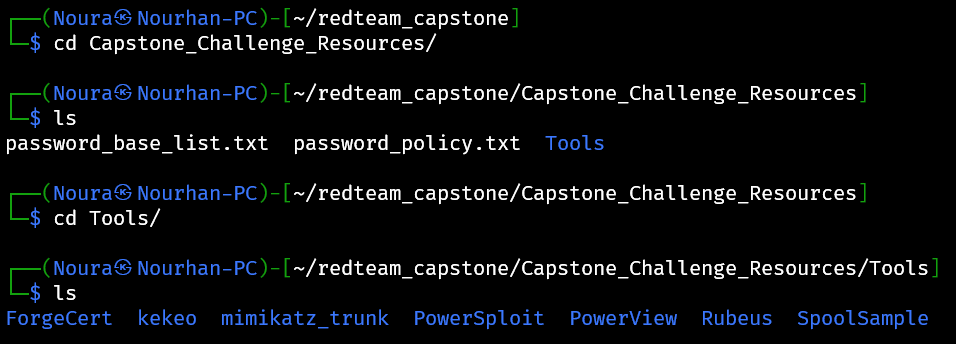

# Information Gathering

Author: Nourhan Sherif
Status: Published
Category: PRD
Last edited time: October 16, 2025 11:40 AM
Created time: October 7, 2025 2:13 PM

### The password of the zip file ⇒ Capstone ( c is capital)

### Notes:

The bank website → [http://swift.bank.thereserve.loc/](http://swift.bank.thereserve.loc/)

- The SWIFT Backend system

- facilitates transfers
- Transfer process
    1. A customer makes a request that funds should be transferred and receives a transfer code.
    2. The customer contacts the bank and provides this transfer code.
    3. An employee with the capturer role authenticates to the SWIFT application and *captures* the transfer.
    4. An employee with the approver role reviews the transfer details and, if verified, *approves* the transfer. This has to be performed from a jump host.
    5. Once approval for the transfer is received by the SWIFT network, the transfer is facilitated and the customer is notified.

### In scope:

- Security testing of TheReserve's internal and external networks, including all IP ranges accessible through your VPN connection.
- OSINTing of TheReserve's corporate website, which is exposed on the external network of TheReserve. Note, this means that all OSINT activities should be limited to the provided network subnet and no external internet OSINTing is required.
- Phishing of any of the employees of TheReserve.
- Attacking the mailboxes of TheReserve employees on the WebMail host (.11).
- Using any attack methods to complete the goal of performing the transaction between the provided accounts.

---

### Given files:

---

To register, you need to get in touch with the government through its e-Citizen communication portal that uses SSH for communication. Here are the SSH details provided:

| **SSH Username** | e-citizen |
| --- | --- |
| **SSH Password** | stabilitythroughcurrency |
| **SSH IP** | X.X.X.250 |

---

To GET your IP range → click extend

so we got :

1. web mail ⇒ `10.200.118.11`
2. vpn ⇒ `10.200.118.12`
3. web ⇒ `10.200.118.13`

so to connect to the SSH i use

- SSH IP ⇒ `10.200.118.250`

### creds:

Username: gteamdepi
Password: RFEbnA2nlswozp-q
MailAddr: gteamdepi@corp.th3reserve.loc
IP Range: 10.200.118.0/24

---

because we have a web server lets try connecting on it

1. open the `/etc/hosts` file to add the ip address of the web server

1. adding the ip address and the domain

1. try to ping on it to check the connection

