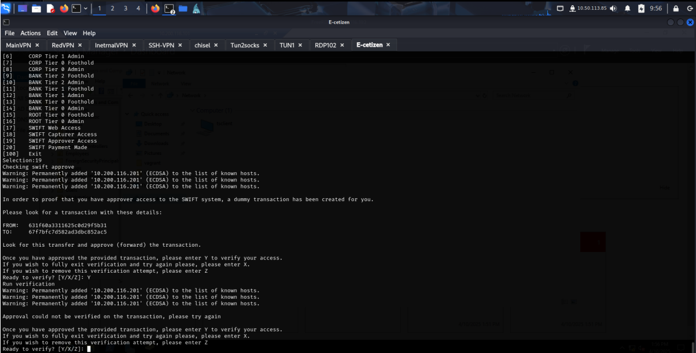
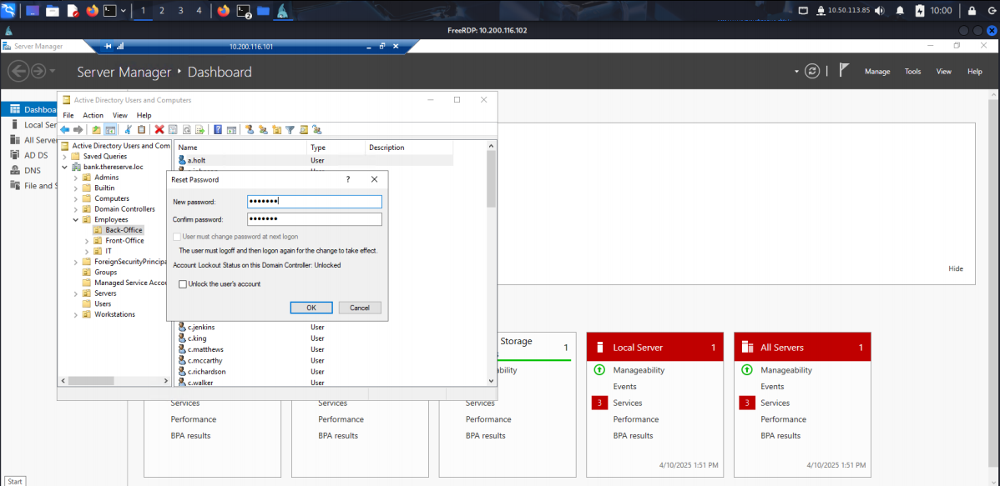
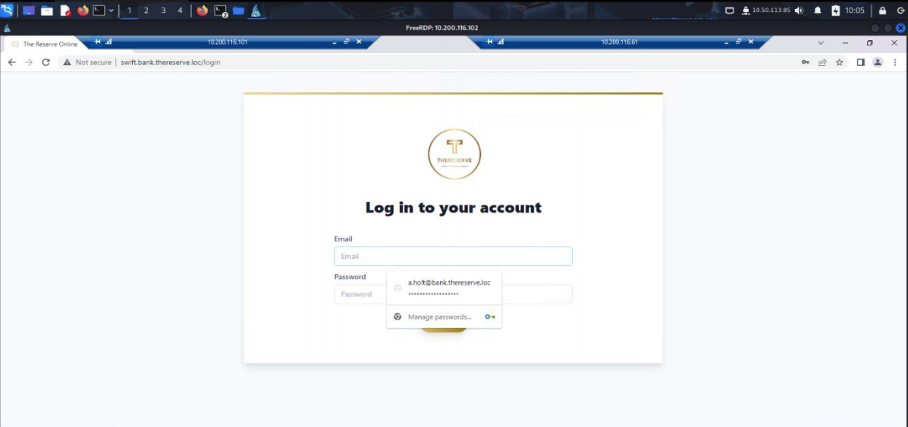
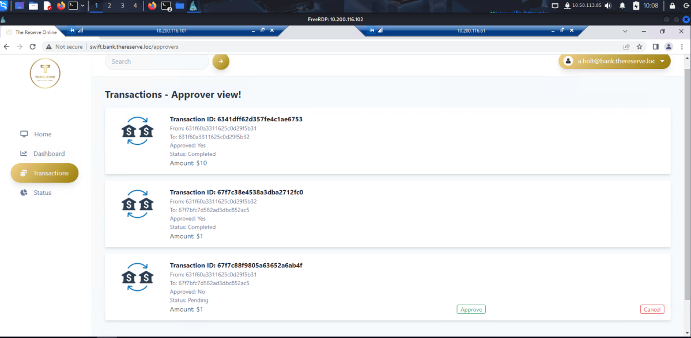
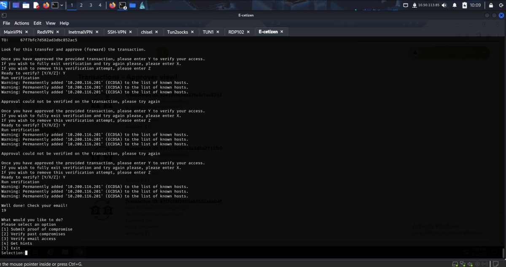

## SWIFT Application as Approver

Demonstrate **approver-level access** to the SWIFT system by locating a specific transaction and forwarding it for final approval.

### **Task Details from E-Citizen Portal**

Upon selecting **[19]** from the **E-Citizen portal**, the following task was received:

In order to prove that you have approver access to the SWIFT system, a dummy transaction has been created.

Approve (forward) the transaction using the SWIFT web portal.
Once done, confirm with “Y” in the E-Citizen portal.

### **Step 1: Enumerating Approver Role Accounts**

From the **Active Directory Users and Computers** interface:

- I identified a group named **“Payment Approvers”**.
- This group had **4 users**, including:
    
    o a.holt (selected for this operation)
    

Since **DCSync and hash extraction won’t work** (due to AD replication restrictions on these accounts), an alternative compromise strategy was needed.

### **Step 2: Exploring Home Directory**

Exploring a.holt Documents as we did with g.watson on the **JMP host**:

- I browsed to Documents and found a file named **swift.txt**.

### **Step 3: Account Takeover via Password Reset**

Using **Enterprise Admin privileges**, I reset the **a.holt** user’s password in Active Directory.

Then, I performed an **RDP login** to the **JMP box**. The contents were different from the capturer’s file and hinted at **browser-stored credentials**.

### **Step 4: Logging into the SWIFT Portal**

With credentials in hand:

- I logged into http://swift.bank.thereserve.loc as **a.holt**.
- Navigated to the dashboard and **located the specific transaction** using the

**FROM** and **TO** IDs provided earlier.

### **Step 5: Approving the Transaction**

- Clicked on the **“Approve”** button to finalize the transaction.
- Verified successful transaction forwarding in the interface.
- Returned to the **E-Citizen portal** and entered **“Y”** to submit Flag 19

By exploiting a mixture of **Active Directory manipulation**, **local enumeration**, and **user behavior patterns**, we were able to **successfully approve a multimillion-dollar SWIFT transaction**.

Flag-19: Access to SWIFT application as approver: THM{e53f46e8-389b-4edb-bb44-34f87993969e}
