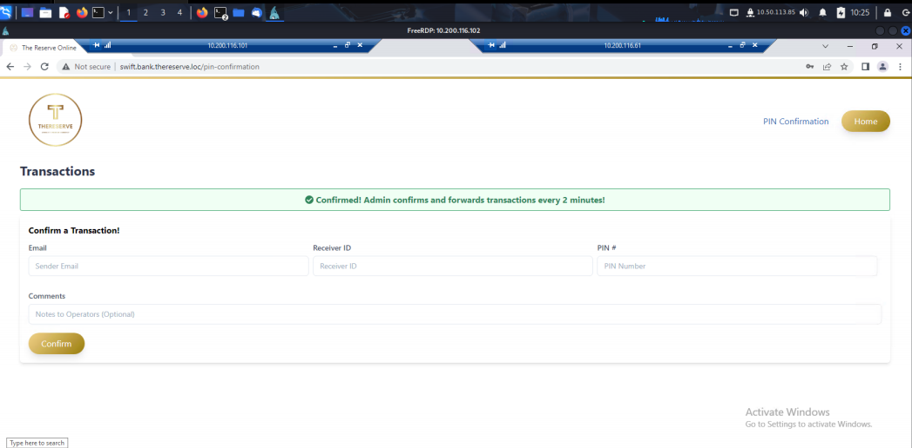
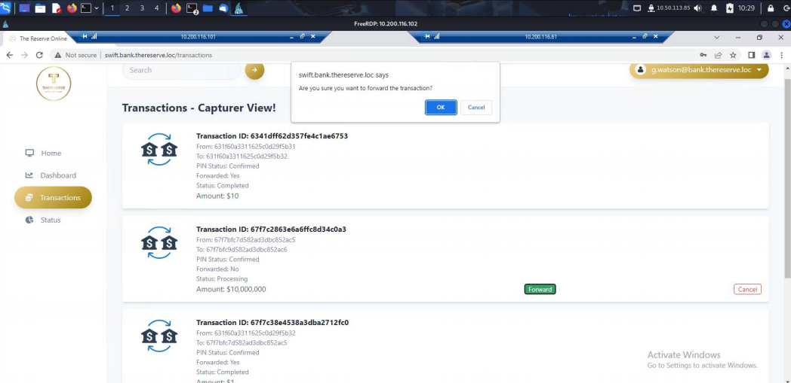
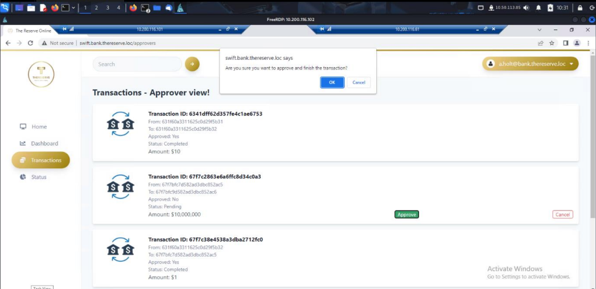
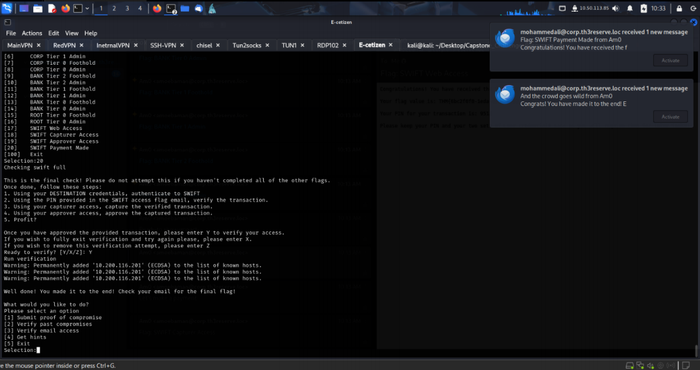

## **SWIFT Payment Made**

Complete the **entire SWIFT transfer lifecycle**, simulating a full-scale attack by leveraging access across different roles, from destination authentication to transaction approval.

### Step 1: **Authenticate to SWIFT as Destination User**

- Logged into http://swift.bank.thereserve.loc using the **destination account credentials** provided in earlier steps.
- Navigated to the **"PIN Confirmation"** section.

### Step 2: **PIN Confirmation**

- Used the **PIN code** from the SWIFT web access task email.
- Confirmed the transaction successfully as per task instructions.

### Step 3: **Capture the Verified Transaction (Capturer Access)**

- Logged in as **Capturer account g.watson**.
- Located the **verified transaction** and clicked **“Forward”** to capture it.

### Step 4: **Approve the Captured Transaction (Approver Access)**

- Switched to **Approver account a.holt** (previously compromised).
- Navigated to the dashboard, reviewed the captured transaction.
- Clicked on **“Approve”** to finalize it.

- **Returned to the E-Citizen portal, entered “Y” to submit and confirm successful transaction execution.**

![image.png](images/image5.png

### Flag-20: Simulated fraudulent transfer made: THM{fd1ad4d0-b01d-455d-a17c-5a4b046e5361}
