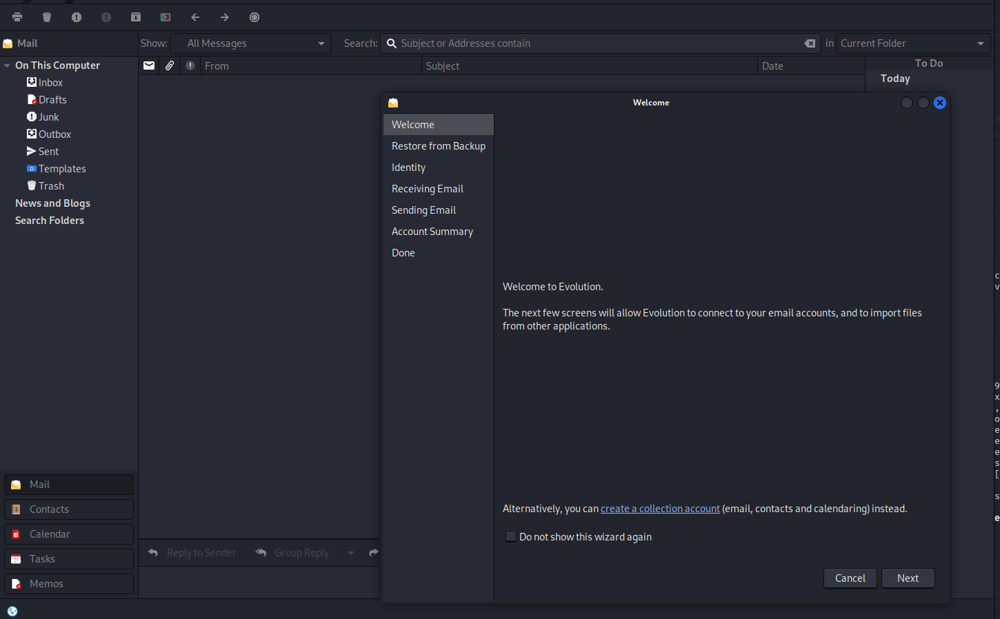

# Mail server enumeration (4)

Author: Nourhan Sherif
Status: Published
Category: PRD
Last edited time: October 9, 2025 11:46 PM
Created time: October 9, 2025 11:38 AM

with the ip of `10.200.118.11`

making nmap scan for it
`nmap -p- 10.200.118.11 -v`

```html
┌──(nourhan㉿kali)-[~/redteam_capstone/Capstone_Challenge_Resources]
└─$ nmap -p- 10.200.118.11 -v
Starting Nmap 7.95 ( https://nmap.org ) at 2025-10-09 04:45 EDT
Initiating Ping Scan at 04:45
Scanning 10.200.118.11 [4 ports]
Completed Ping Scan at 04:45, 0.14s elapsed (1 total hosts)
Initiating SYN Stealth Scan at 04:45
Scanning MAIL.thereserve.loc (10.200.118.11) [65535 ports]
Discovered open port 139/tcp on 10.200.118.11
Discovered open port 445/tcp on 10.200.118.11
Discovered open port 25/tcp on 10.200.118.11
Discovered open port 135/tcp on 10.200.118.11
Discovered open port 3306/tcp on 10.200.118.11
Discovered open port 22/tcp on 10.200.118.11
Discovered open port 80/tcp on 10.200.118.11
Discovered open port 143/tcp on 10.200.118.11
Discovered open port 3389/tcp on 10.200.118.11
Discovered open port 587/tcp on 10.200.118.11
Discovered open port 110/tcp on 10.200.118.11

```

more advanced nmap scan `nmap -p139,445,25,135,3306,22,80,143,3389,587,110 -A 10.200.118.11 -v`

```html
PORT     STATE SERVICE       VERSION
22/tcp   open  ssh           OpenSSH for_Windows_7.7 (protocol 2.0)
| ssh-hostkey: 
|   2048 f3:6c:52:d2:7f:e9:0e:1c:c1:c7:ac:96:2c:d1:ec:2d (RSA)
|   256 c2:56:3c:ed:c4:b0:69:a8:e7:ad:3c:31:05:05:e9:85 (ECDSA)
|_  256 d3:e5:f0:73:75:d5:20:d9:c0:bb:41:99:e7:af:a0:00 (ED25519)
25/tcp   open  smtp          hMailServer smtpd
| smtp-commands: MAIL, SIZE 20480000, AUTH LOGIN, HELP
|_ 211 DATA HELO EHLO MAIL NOOP QUIT RCPT RSET SAML TURN VRFY
80/tcp   open  http          Microsoft IIS httpd 10.0
| http-methods: 
|   Supported Methods: OPTIONS TRACE GET HEAD POST
|_  Potentially risky methods: TRACE
|_http-title: 403 - Forbidden: Access is denied.
|_http-server-header: Microsoft-IIS/10.0
110/tcp  open  pop3          hMailServer pop3d
|_pop3-capabilities: USER UIDL TOP
135/tcp  open  msrpc         Microsoft Windows RPC
139/tcp  open  netbios-ssn   Microsoft Windows netbios-ssn
143/tcp  open  imap          hMailServer imapd
|_imap-capabilities: RIGHTS=texkA0001 completed IDLE SORT NAMESPACE OK CHILDREN IMAP4rev1 CAPABILITY IMAP4 ACL QUOTA
445/tcp  open  microsoft-ds?
587/tcp  open  smtp          hMailServer smtpd
| smtp-commands: MAIL, SIZE 20480000, AUTH LOGIN, HELP
|_ 211 DATA HELO EHLO MAIL NOOP QUIT RCPT RSET SAML TURN VRFY
3306/tcp open  mysql         MySQL 8.0.31
|_ssl-date: TLS randomness does not represent time
| ssl-cert: Subject: commonName=MySQL_Server_8.0.31_Auto_Generated_Server_Certificate
| Issuer: commonName=MySQL_Server_8.0.31_Auto_Generated_CA_Certificate
| Public Key type: rsa
| Public Key bits: 2048
| Signature Algorithm: sha256WithRSAEncryption
| Not valid before: 2023-01-10T07:46:11
| Not valid after:  2033-01-07T07:46:11
| MD5:   1bd2:ba34:dd9d:39a0:fba2:5013:eb1f:b3f6
|_SHA-1: 406b:cedd:04f3:dd8e:1784:2fd6:cefd:a0d7:1382:4cdf
| mysql-info: 
|   Protocol: 10
|   Version: 8.0.31
|   Thread ID: 10
|   Capabilities flags: 65535
|   Some Capabilities: SwitchToSSLAfterHandshake, LongPassword, SupportsCompression, Speaks41ProtocolOld, IgnoreSpaceBeforeParenthesis, SupportsTransactions, IgnoreSigpipes, Support41Auth, DontAllowDatabaseTableColumn, LongColumnFlag, ODBCClient, InteractiveClient, ConnectWithDatabase, SupportsLoadDataLocal, FoundRows, Speaks41ProtocolNew, SupportsMultipleStatments, SupportsMultipleResults, SupportsAuthPlugins
|   Status: Autocommit
|   Salt: t\x08nM\x02;1_\x07%\x11A
| m>,_.4\
|_  Auth Plugin Name: caching_sha2_password
3389/tcp open  ms-wbt-server Microsoft Terminal Services
|_ssl-date: 2025-10-09T08:56:05+00:00; -26s from scanner time.
| ssl-cert: Subject: commonName=MAIL.thereserve.loc
| Issuer: commonName=MAIL.thereserve.loc
| Public Key type: rsa
| Public Key bits: 2048
| Signature Algorithm: sha256WithRSAEncryption
| Not valid before: 2025-10-01T12:25:42
| Not valid after:  2026-04-02T12:25:42
| MD5:   297d:bafa:8008:fddd:ea8e:c3ed:c713:010a
|_SHA-1: e2ab:c0e8:3b7e:d6f0:614f:35e4:27d9:311b:b912:7c7d
| rdp-ntlm-info: 
|   Target_Name: THERESERVE
|   NetBIOS_Domain_Name: THERESERVE
|   NetBIOS_Computer_Name: MAIL
|   DNS_Domain_Name: thereserve.loc
|   DNS_Computer_Name: MAIL.thereserve.loc
|   Product_Version: 10.0.17763
|_  System_Time: 2025-10-09T08:55:54+00:00

```

i installed evolution to open the mail server with my credintials



and found this in the inbox


> عشان تدخلي علي ال mail server 
بعد منزلتي ال evolution
1. run the next command ⇒ # evolution
2. هيفتح معاكي صفحه ال mail 
3. هتقولي Next 
4. لحد ميظهر معاكي ال Identify
5. هتكتبي ال name & email وتقولي Next
           - Username: gteamdepi
           - Password: RFEbnA2nlswozp-q
           - MailAddr: gteamdepi@corp.th3reserve.loc
6. Next
7. In the IMAP 
           - set the port to 110
           - set the server to 10.200.118.11
8. In the SMTP 
           - set the port to 25
           - set the server to the IP 
9. Next and Next and Apply
> 

---

## We found this email address

 [amoebaman@corp.th3reserve.loc](mailto:amoebaman@corp.th3reserve.loc)

using the creds we got i connect to lauras account


and we found nothing it is empty

i tried the other user creds.
