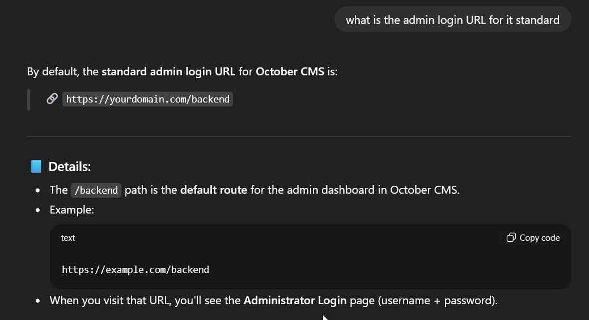

# October CMS (5)

Author: Nourhan Sherif
Status: Published
Category: PRD
Last edited time: October 18, 2025 5:12 PM
Created time: October 9, 2025 10:42 AM

because i don’t know what is October CMS so i asked chatgpt about it and i found that

so i tried to brute force how can i access this admin login

and after some time i got that

i tried admin/admin and intercept the request in burp and i found that

so i can make username enumeration

and this was given to us in the lab files:

so i have to make a custome list to specify the password policy so i will john the repper

and i make this custome list

and we got our list

and i stored it in a file 

using the names we got from the directly listing we found the i

i asked chatgpt to make me a script to add the email at the end of each name

and now i brute force using hydra and got this 

`laura.wood@corp.thereserve.loc : Password1@`

and we got another one !!

`mohammad.ahmed@corp.thereserve.loc:Password1!`
