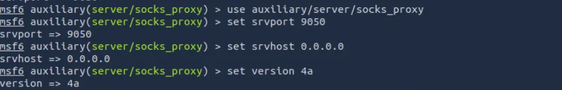

# Pivoting Using Metasploit’s SOCKS Proxy

**Start Metasploit SOCKS proxy (so you can proxy traffic through the compromised host)**
⇒ This creates a local SOCKS listener you can use with `proxychains`

Add routes for the internal subnet (autoroute) 

`set session 1` and `run` 

**To select the active Meterpreter session to execute post-exploitation modules and commands on the compromised target.**

